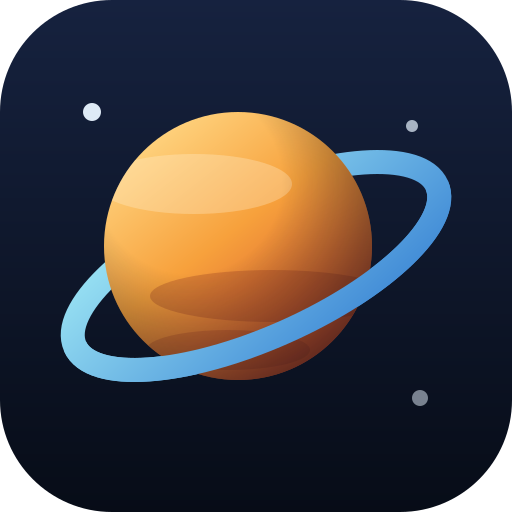
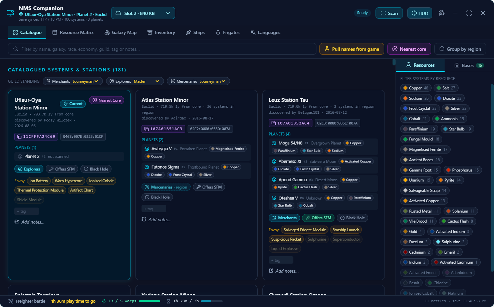
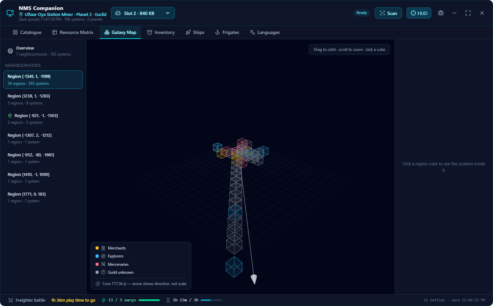
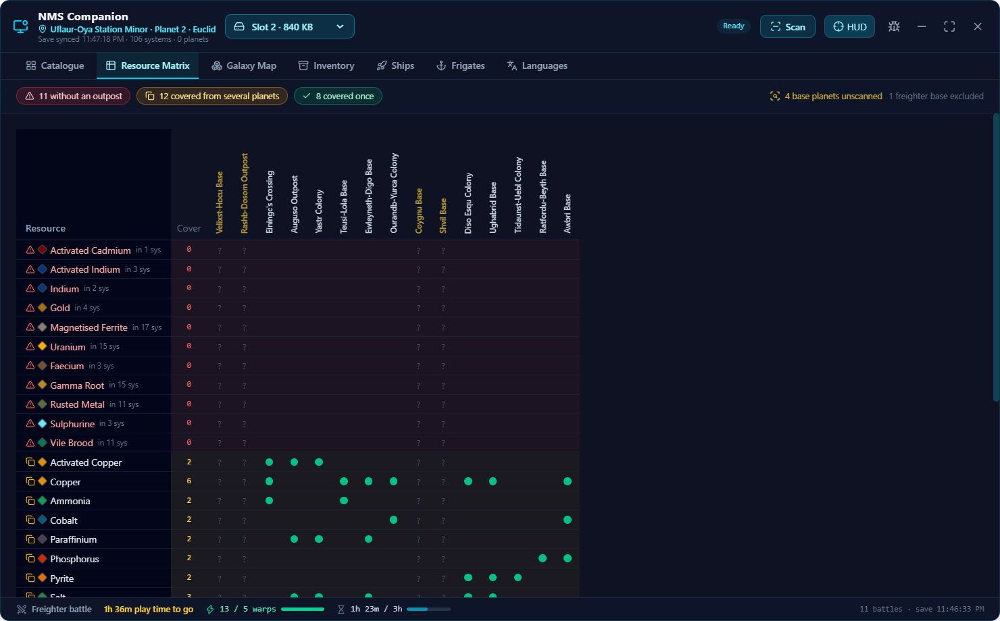
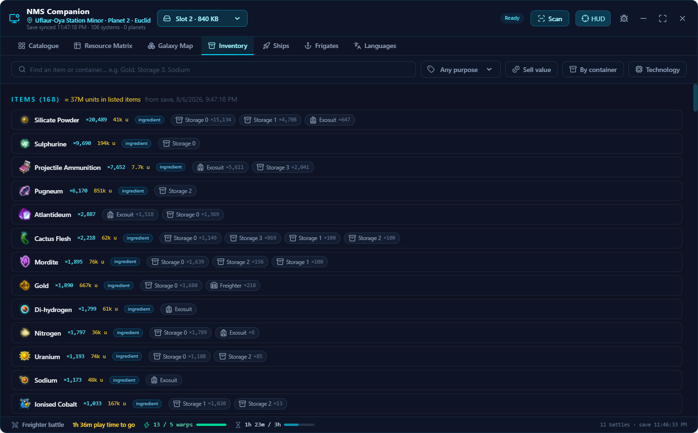
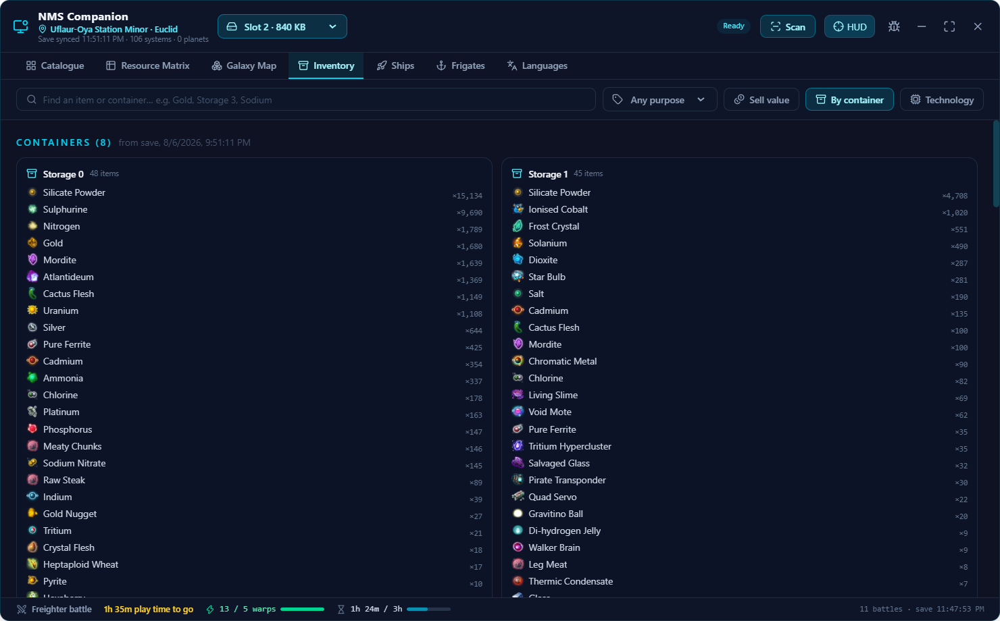
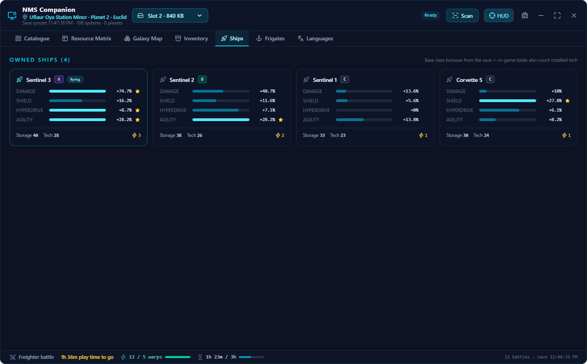
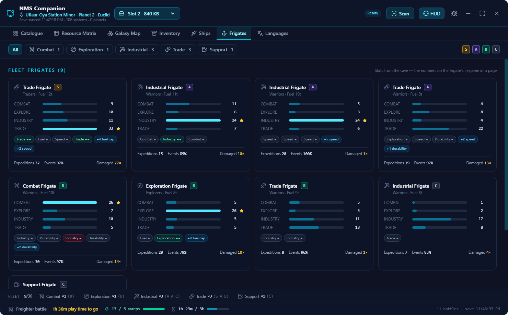
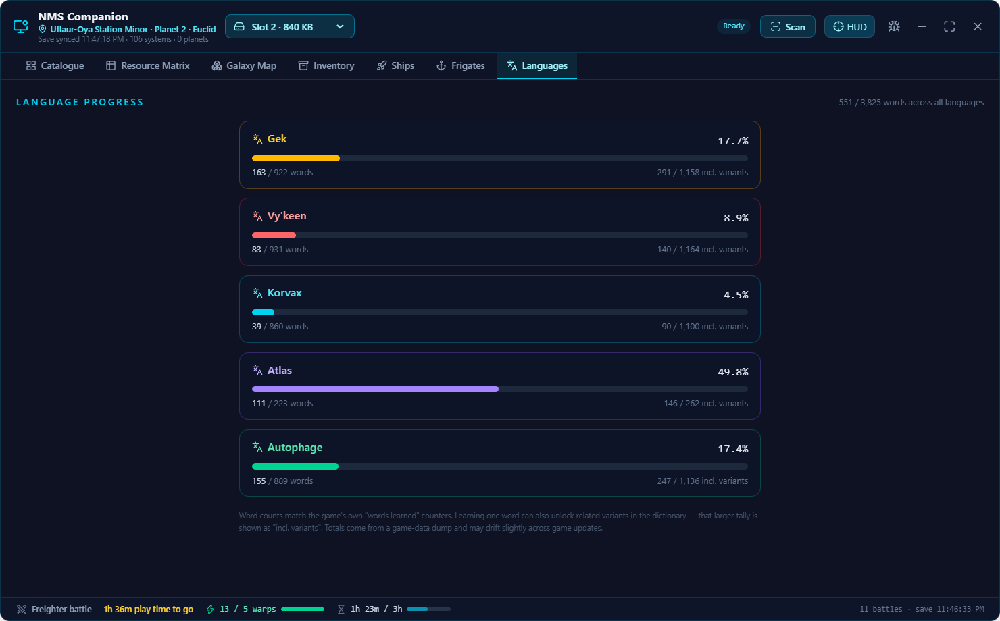
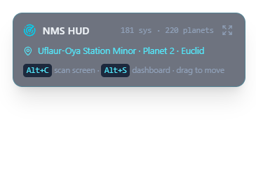

# NMS Companion & Planet Cataloguer

A local Electron companion app for **No Man's Sky**. It watches your save files to catalogue systems, stations, ships and inventory, and OCR-scans the game screen (`Alt+C`) to record planet, system and guild-envoy data — all stored per character, fully offline. 100 % TypeScript.



## Capabilities

### Data comes in three ways

- **Save watcher** — watches `%APPDATA%\HelloGames\NMS\` (Steam `st_*` and GOG `DefaultUser` profiles) for `save*.hg` writes. Saves are opened strictly read-only, LZ4-decompressed in pure TypeScript and parsed: discovered systems, teleporter endpoints, bases, every inventory, ships, frigates, language progress and discovery credit are upserted into the catalogue keyed by universal address. Your own metadata (tags, notes, guild, toggles) is never overwritten by a re-sync.
- **OCR screen scanner** (`Alt+C`) — screenshots the game, crops proportional UI zones (16:9 and 21:9 layouts) and reads them with PP-OCR on onnxruntime (models downloaded on first use), falling back automatically to sharp-preprocessed tesseract.js. One hotkey press recognises whichever screen you're on:
  - **Analysis Visor / Discovery panel** → planet type, weather, sentinels, flora, fauna, resources
  - **System information panel** → race, economy, conflict level, matched onto the catalogued system
  - **Guild envoy stock list** → guild, your rank, SFM availability and all six stock rows
  The whole hotkey → database-commit cycle stays inside a 1.5 s budget.
- **Game-memory name harvest** (experimental, Windows only) — procedural system/planet names are never written to save files; they only exist inside the running game. The "Pull names from game" button does a read-only scan of the NMS process for its in-memory discovery records and fills in systems still called "Unknown System" and placeholder planet names. Multiple calibration gates compare scanned names of already-known systems and discard the whole batch on disagreement, so a game update that shifts the memory layout fails closed.

### Dashboard views

| Tab | What it shows |
| --- | --- |
| **Catalogue** | Card grid of every system: station teleporter, race/economy/conflict, planets, portal glyphs, guild + envoy stock (with rank-locked badges), SFM and black-hole toggles, tags and notes, discovery credit ("discovered by …"). Free-text filter, resource filters, group-by-region, "Nearest core" jump. |
| **Resource Matrix** | Base-building coverage table: which resources your bases already cover, which are missing or doubled up, with jumps to the systems that could host the missing outpost. |
| **Galaxy Map** | 3D map (react-three-fiber) with two zoom levels: an overview placing every catalogued neighbourhood at its true position around the galactic core, and a lattice view of one neighbourhood's region cubes with per-system stars, guild colouring and a region detail panel. |
| **Inventory** | Everything in every container — exosuit, multi-tools, ships, freighter, storage containers, exocraft — as a searchable "where is my stuff" view, grouped by item or by container. A **Sell value** mode ranks items by estimated galactic-market value, badges trade goods vs crafting ingredients, and suggests where to sell based on catalogued economies. |
| **Ships** | Side-by-side comparison of your fleet's damage / shield / hyperdrive / agility stats with class badges. |
| **Frigates** | Frigate fleet overview by type with combat / exploration / industry / trade expedition stats. |
| **Languages** | Word-learning progress bars per race (Gek, Vy'keen, Korvax, Atlas, Autophage). |

### Always-on-top HUD

A second frameless glass window floats over the game: last scan summary, current location, catalogue counters, and the pinned portal address rendered as dialable in-game glyph tiles. `Alt+S` bounces focus between game and dashboard — toward the game the HUD turns click-through; toward the dashboard it becomes draggable. Both windows remember their bounds across restarts.

### Quality-of-life intelligence

- **Per-character catalogues** — every save slot gets its own database; systems, planets, bases, inventory and guild standings never mix between characters. The slot picker's **Auto (follow game)** mode tracks whichever save was written last, so switching characters in-game switches the catalogue by itself.
- **Portal glyphs** — every system card shows its 12-glyph portal address; copying pins it to the HUD (and the window title) until you arrive, then it unpins itself on the next save sync.
- **Freighter-battle status bar** — the footer tracks both gates for the next pirate-attacked-freighter encounter (5 warps + 3 h play time since the last space battle) and turns green when the next warp can trigger a rescue.
- **Region guild inference** — every station in a region hosts the same guild, so one envoy scan reveals the guild of every catalogued system sharing that voxel; inferred guilds show as dashed chips you can confirm onto the record.
- **Guild standing tracking** — your rank with each guild is auto-updated by envoy scans (editable by hand) and decides which envoy stock rows render as locked.

## Screenshots

| | |
| --- | --- |
|  *Galaxy Map — a neighbourhood's region lattice, coloured by guild* |  *Resource Matrix — base coverage* |
|  *Inventory — where is my stuff* |  *Inventory — by container* |
|  *Ship comparison* |  *Frigate fleet* |
|  *Language progress* | |

<br/>*The in-game HUD overlay*

## Getting it

Grab a Windows build from the [GitHub Actions](../../actions/workflows/build-windows.yml) artifacts (or a tagged [release](../../releases)) — three flavours, all the same app:

| Asset | What it is |
| --- | --- |
| `nms-companion-<version>-setup.exe` | Installer, with Start Menu shortcut and an uninstall entry |
| `nms-companion-<version>-portable.exe` | Single file, no install. Unpacks to `%TEMP%\NMSCompanion` on first run (slow first launch, normal afterwards) |
| `nms-companion-<version>-win.zip` | Unpacked folder — extract anywhere and run `NMS Companion.exe` |

All three read and write the same catalogue in `%APPDATA%\nms-companion`, so you can switch between them freely.

Or build locally:

```bash
npm install
npm run dev       # dev mode with HMR
npm run build     # production bundles into out/
npm run dist:win  # installer + portable exe + zip into release/
```

No native build step needed: better-sqlite3, sharp, onnxruntime and koffi all ship prebuilt binaries, with an automatic fallback to a JSON file store if SQLite can't load.

## Hotkeys

| Key | Action |
| --- | --- |
| `Alt+C` | Capture screen → OCR → parse planet / system / envoy data → save to catalogue |
| `Alt+S` | Bounce focus between the game and the dashboard. Toward the game the HUD turns click-through and the dashboard drops behind the game (it stays visible on a second monitor); toward the dashboard it comes to the front focused and the HUD becomes draggable |

## Obfuscated saves

Recent NMS versions ship saves with obfuscated JSON keys. Drop a mapping file (obfuscated → readable key, e.g. exported from libMBIN / NMS Save Editor) at:

```
%APPDATA%\nms-companion\nms-keymap.json
```

and the parser de-obfuscates the tree before extraction. Plain-key saves work out of the box.

## Development

```bash
npm run typecheck  # tsc over main/preload and renderer projects
npm test           # builds tests/ then runs node --test
```

Parsers are tested against real captured OCR text in `tests/fixtures/` (both tesseract and PP-OCR variants). Architecture notes live in `CLAUDE.md`; save files are never written to, and everything under `src/shared/` is dependency-free so it can be shared by main, renderer and tests.
